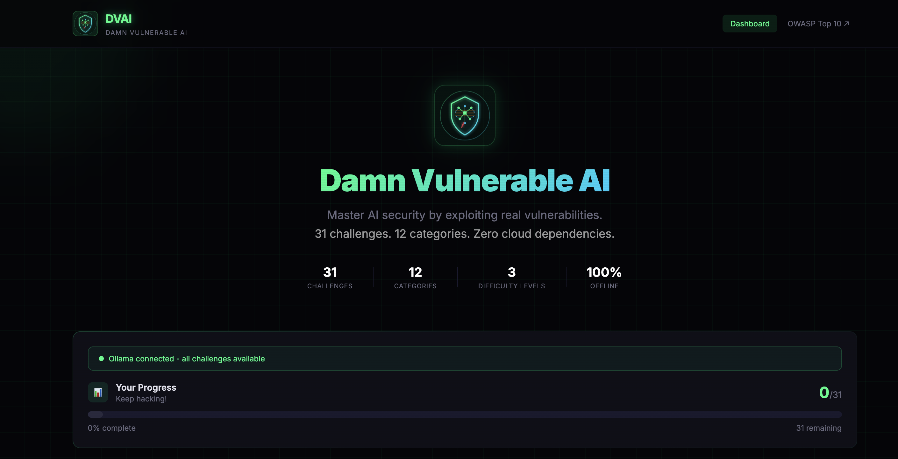
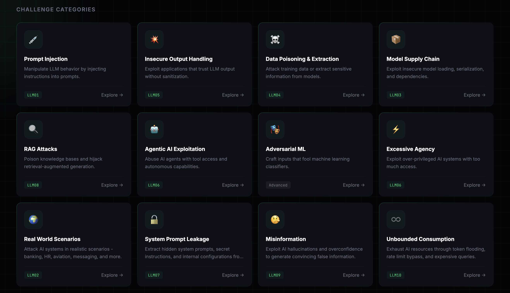

<div align="center">


# DVAI - Damn Vulnerable AI

**The hands-on AI security training platform.**

Learn to hack AI systems by actually hacking them. 31 challenges. 12 categories. Zero cloud dependencies.

[](https://www.python.org/downloads/)
[](https://nodejs.org/)
[](https://genai.owasp.org/llm-top-10/)
[](LICENSE)
[](#challenge-categories)
[](#)

[Quick Start](#-quick-start) · [Challenges](#-challenge-categories) · [Architecture](#-architecture) · [Contributing](CONTRIBUTING.md)

</div>

---

## What is DVAI?

DVAI is a deliberately vulnerable AI application where you attack real (and simulated) AI systems to learn how they break. It covers everything from prompt injection to adversarial ML, model supply chain attacks, RAG exploitation, and agentic AI abuse.

Unlike reading about AI security, DVAI lets you **craft the exploits yourself** - inject prompts, poison training data, tamper with models, abuse AI agents, and watch them fail. Every challenge has a flag to capture, hints when you're stuck, and a story to make it fun.

**Works without a GPU. Works without internet. Works without Ollama.** The built-in simulation mode means you can start hacking in 2 minutes.

<div align="center">

<p><em>Dashboard - Progress Tracking</em></p>
<br>

<p><em>Challenges Categories</em></p>
</div>

## Why DVAI?

| | DVAI | Other Platforms |
|---|---|---|
| **Setup** | 2 minutes, one command | Complex provisioning, cloud accounts |
| **Offline** | 100% local, no internet needed | Often cloud-dependent |
| **GPU required** | No (simulation mode) | Usually yes |
| **Challenge variety** | 31 across 12 categories | Narrow focus, fewer attack types |
| **ML attacks** | Adversarial images, pickle RCE, model tampering | Rarely covered |
| **Fun factor** | Stories, funny flags, animations | Documentation-heavy |
| **Difficulty** | 3 levels per challenge | Static or global toggle |
| **API testing** | OpenAI-compatible endpoint included | Not available |

## 🚀 Quick Start

### One Command
```bash
git clone https://github.com/offensiveai26/dvai.git
cd dvai
./start.sh
# Open http://localhost:3000
```

### Docker
```bash
docker compose up --build
# Open http://localhost:3000
```
Starts everything including a local LLM. No API keys needed.

### Manual Setup
```bash
# Terminal 1 - Backend
cd backend
python3 -m venv venv && source venv/bin/activate
pip install -r requirements.txt
python3 -m uvicorn app.main:app --port 8000 --reload

# Terminal 2 - Frontend
cd frontend
npm install && npm run dev

# Open http://localhost:3000
```

### Add Ollama (Optional - for real LLM attacks)
```bash
brew install ollama       # macOS
ollama serve && ollama pull llama3.2
```
The dashboard shows a green indicator when connected. Without Ollama, everything runs in simulation mode.

## 🤖 Simulation Mode vs Ollama

| Feature | Simulation Mode | With Ollama |
|---------|----------------|-------------|
| All 31 challenges | ✅ | ✅ |
| LLM challenges | Simulated responses | Real LLM responses |
| Setup time | 2 minutes | 5 minutes |
| Disk space | ~500 MB | ~4 GB (model) |
| Realism | Good for learning | Production-realistic |
| GPU required | No | No (CPU works) |

**Simulation mode** uses a deliberately vulnerable simulated LLM that responds to common attack patterns. Great for learning. **Ollama mode** gives you a real LLM to attack - more realistic and unpredictable.

## 🎯 Challenge Categories

| # | Category | Challenges | OWASP | What You'll Attack |
|---|----------|:---------:|-------|-------------------|
| 1 | 💉 Prompt Injection | 3 | LLM01 | Override instructions, hijack summarizers, jailbreak guardrails |
| 2 | 💥 Insecure Output | 3 | LLM05 | XSS through AI, SQL injection via natural language, code execution |
| 3 | ☠️ Data Poisoning | 3 | LLM04 | Backdoor classifiers, extract training data, membership inference |
| 4 | 📦 Supply Chain | 2 | LLM03 | Pickle deserialization RCE, model weight tampering |
| 5 | 🔍 RAG Attacks | 3 | LLM08 | Poison knowledge bases, hijack retrieval, overflow context windows |
| 6 | 🤖 Agentic AI | 3 | LLM06 | Abuse file-reading agents, escalate permissions, hijack reasoning chains |
| 7 | 🎭 Adversarial ML | 2 | N/A | Fool image classifiers with noise, evade malware detectors |
| 8 | ⚡ Excessive Agency | 3 | LLM06 | Exploit over-privileged AI, SSRF via AI, escape sandboxes |
| 9 | 🌍 Real World | 6 | LLM02 | Hack banking AI, leak salaries, hijack flights, steal exams |
| 10 | 🔓 Prompt Leakage | 1 | LLM07 | Extract hidden system prompts and secret configurations |
| 11 | 🤥 Misinformation | 1 | LLM09 | Make AI hallucinate with confidence, catch it lying |
| 12 | ♾️ Unbounded Consumption | 1 | LLM10 | Exhaust token budgets, bypass rate limits |

**Total: 31 challenges** - each with 3 difficulty levels (Easy / Medium / Hard) = 93 unique attack scenarios.

## 🏗️ Architecture

```
┌──────────────────────────────────────────────┐
│         Frontend (React + Tailwind)          │
│       Cyberpunk UI + Terminal Interface      │
├──────────────────────────────────────────────┤
│         Backend (Python + FastAPI)           │
│     Challenge Engine + Progress Tracking     │
├───────────┬──────────┬───────────┬───────────┤
│ LLM       │ ML       │ Agent     │ RAG       │
│ Attacks   │ Attacks  │ Attacks   │ Attacks   │
├───────────┼──────────┴───────────┼───────────┤
│ Ollama    │ Simulated Models     │ SQLite    │
│ (optional)│ ChromaDB (RAG)       │ (progress)│
└───────────┴──────────────────────┴───────────┘
```

## 🎮 Features

- **31 challenges** across 12 categories covering the full OWASP Top 10 for LLMs
- **3 difficulty levels** per challenge - no defenses → basic guardrails → hardened
- **Hint system** with progressive reveals - unlock one at a time
- **Flag-based validation** - dynamic flags generated at runtime, never in source code
- **Score tracking** and progress dashboard
- **Simulation mode** - every challenge works without Ollama
- **OpenAI-compatible API** (`/v1/chat/completions`) - test your security tools against it
- **100% offline** - runs entirely on your machine
- **Fun** - every challenge has a story, personality, and a celebration when you win

## 📖 Who Is This For?

- **Security researchers** exploring AI attack surfaces
- **Developers** building AI-powered applications who want to understand the risks
- **Red teamers** adding AI exploitation to their skillset
- **Students** learning about ML/AI security hands-on
- **CTF players** looking for AI-specific challenges
- **Workshop instructors** teaching AI security (see [Contributing](CONTRIBUTING.md))

## ⚙️ Configuration

| Environment Variable | Default | Description |
|---------------------|---------|-------------|
| `OLLAMA_URL` | `http://localhost:11434` | Ollama server URL |
| `OLLAMA_MODEL` | `llama3.1:8b` | Model to use |
| `DVAI_FLAG_SECRET` | `dvai-default-secret-change-me-in-prod` | Secret for flag generation |
| `DATABASE_URL` | `sqlite:///./dvai.db` | Database path |

## 🔧 Troubleshooting

| Problem | Fix |
|---------|-----|
| **Backend won't start** | Check Python 3.11-3.13 installed (3.14 not yet supported), `pip install -r requirements.txt` |
| **Frontend blank page** | Make sure backend is running on port 8000 |
| **"Connection failed" in terminal** | Backend not running - check terminal for errors |
| **Ollama not detected** | Run `ollama serve` in a separate terminal |
| **Challenges feel too easy** | Switch to Medium or Hard difficulty |
| **Simulation mode responses are generic** | Try common attack patterns from the hints |

## 📁 Project Structure

```
DVAI/
├── backend/                    Python backend (FastAPI)
│   ├── app/
│   │   ├── main.py             App entry point
│   │   ├── flags.py            Dynamic flag generator (HMAC)
│   │   ├── llm.py              Ollama client + simulation mode
│   │   ├── db.py               Database setup
│   │   ├── models.py           SQLAlchemy models
│   │   ├── api/                API routes
│   │   │   ├── challenges.py   Challenge endpoints
│   │   │   ├── progress.py     Progress tracking
│   │   │   ├── health.py       Health check + Ollama status
│   │   │   └── openai_compat.py  OpenAI-compatible API
│   │   └── challenges/         Challenge handlers (31 total)
│   │       ├── registry.py     Challenge definitions
│   │       ├── prompt_injection/
│   │       ├── insecure_output/
│   │       ├── data_poisoning/
│   │       ├── supply_chain/
│   │       ├── rag/
│   │       ├── agentic/
│   │       ├── adversarial/
│   │       ├── excessive_agency/
│   │       ├── real_world/
│   │       ├── prompt_leakage/
│   │       ├── misinformation/
│   │       └── unbounded/
│   ├── requirements.txt
│   └── Dockerfile
├── frontend/                   React frontend
│   ├── src/
│   │   ├── App.jsx             Router
│   │   ├── api.js              API client
│   │   ├── pages/
│   │   │   ├── Dashboard.jsx   Home + category grid
│   │   │   ├── CategoryPage.jsx  Challenge list
│   │   │   └── ChallengePage.jsx Terminal + hints + flag submit
│   │   └── components/
│   │       └── Layout.jsx      Header + footer
│   ├── public/logo.svg
│   └── package.json
├── docker-compose.yml          One-command Docker setup
├── start.sh                    Start backend + frontend
├── stop.sh                     Stop everything
├── CONTRIBUTING.md
├── SECURITY.md
└── LICENSE                     MIT
```

## 🛡️ Security

DVAI is intentionally vulnerable. The vulnerabilities are features, not bugs. See [SECURITY.md](SECURITY.md) for what to report and what not to.

## 🤝 Contributing

Want to add a challenge, fix a bug, or improve the docs? See [CONTRIBUTING.md](CONTRIBUTING.md).

## ⚠️ Disclaimer

DVAI is intentionally vulnerable. **DO NOT** deploy it on any public-facing server. It is designed for local educational use only.

## 👨‍💻 Author

Developed & Designed by **Vivek Trivedi**

## 📄 License

MIT License - see [LICENSE](LICENSE) for details.
